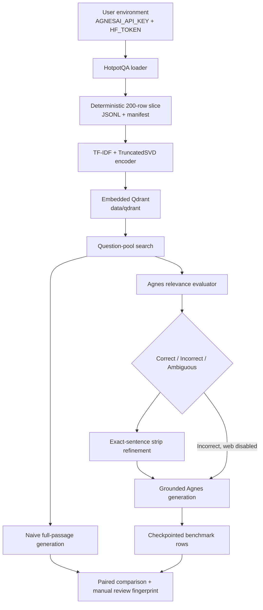

# Technical reference

This reference describes the current Windows-native CRAG tutorial. It is for maintainers and advanced learners who need the interfaces, data flow, cache behavior, and recovery rules. It documents the repository as implemented. It does not describe a production service or a paper reproduction.

For concepts and a notebook-first learning path, read [CRAG from zero to mastery](tutorial-guide.md). For metric definitions and observed results, read [evaluation and limitations](evaluation-and-limitations.md).

## Architecture



All runtime state stays inside the repository’s ignored `data/` tree. Credentials are read from the process environment and are never persisted by repository code.

## Runtime configuration and startup

| Item | Implemented value or behavior |
|---|---|
| Model | `agnes-3.0-flash` only; passing another model raises `ValueError`. |
| Provider endpoint | Fixed `https://apihub.agnes-ai.com/v1`. `AGNES_BASE_URL` is not used as an override. |
| API client | Official `openai` Python client, Chat Completions API. |
| Provider credential | `AGNESAI_API_KEY` in the process environment. Missing key raises `ModelRequestError`. |
| Hugging Face credential | `HF_TOKEN` in the process environment. |
| Vector store | Local `QdrantClient(path="data/qdrant")`; no Qdrant Cloud, API key, Docker, or WSL. |
| Launcher | `run.cmd` uses `py -3 -m venv .venv`, installs requirements, registers `crag-tutorial`, then opens notebook 01. |

`run.cmd` guards against a free-threaded Python build because the verified launcher path needs a regular Python 3.11+ build for native dependency wheels. It scopes `PY_PYTHON3` to the command session and leaves global Python configuration unchanged. An unsuitable existing `.venv` is rejected and left in place.

### Exported package surface

`src.__init__` re-exports the course-facing interfaces below. Paths and constants are `pathlib.Path` values rooted at the repository; the model and endpoint are fixed tutorial configuration.

| Export | Purpose |
|---|---|
| `BASE_URL`, `MODEL_NAME` | Fixed Agnes endpoint and the only permitted model. |
| `UPPER_THRESHOLD`, `LOWER_THRESHOLD` | Default Correct/Incorrect route boundaries: `.7` and `.3`. |
| `QDRANT_PATH`, `CACHE_DIR`, `DATA_DIR` | Repository-local storage locations. |
| `check_environment()` | Returns Boolean presence flags for `AGNESAI_API_KEY` and `HF_TOKEN`; never returns values. |
| `get_openai_client()`, `chat(...)` | Create the configured OpenAI-compatible client and make a guarded chat request. |
| `download_or_load(...)`, `build_slice(...)` | Load HotpotQA and create/validate the deterministic course slice. |
| `get_qdrant_client(...)`, `close_qdrant_client()`, `index_slice(...)` | Open/close embedded Qdrant and create/validate the paragraph index. |
| `search(...)` | Return ranked payload-bearing hits, optionally filtered to a question pool. |
| `extract_json_object(...)`, `evaluate_documents(...)`, `decide_action(...)`, `refine_strips(...)`, `generate_answer(...)` | Validated CRAG primitives. |
| `run_naive_rag(...)`, `run_comparison_50(...)`, `automated_metrics(...)`, `load_manual_reviews(...)` | Paired baseline, resumable comparison, descriptive summary, and review validation. |

## Data and retrieval contracts

### HotpotQA slice

`src.data_hotpot.download_or_load(cache_dir=None, token=None)` loads:

```text
dataset: hotpotqa/hotpot_qa
configuration: distractor
split: validation
```

The caller-provided `token` wins; otherwise the loader reads `HF_TOKEN`. Load failures are re-raised as a credential/network/cache diagnostic without provider details.

`build_slice(n=200, seed=42, output_path=None, smoke_path=None, force_rebuild=False)` creates or validates a deterministic JSONL slice. Each record contains:

| Field | Meaning |
|---|---|
| `id` | HotpotQA question ID. |
| `question` / `gold_answer` | Question and reference answer. |
| `gold_titles` | De-duplicated annotated supporting-fact titles, if supplied by the dataset. |
| `question_type` / `level` | Dataset metadata, or `unknown` when absent. |
| `context_paragraphs` | Objects with `title`, joined `text`, source `sentences`, and `is_gold`. |
| `is_gold` | Per-paragraph gold flags, or `None` when annotations are unavailable. |

The slice manifest binds the dataset/config/split, `n`, seed, schema version, and a content fingerprint. A matching manifest and JSONL are reused; mismatches rebuild the slice. The smoke list selects up to four `bridge` IDs and four `comparison` IDs from the slice, filling from remaining IDs only if needed.

### Encoder and Qdrant index

`src.qdrant_store.TFIDFSVDEncoder` fits a `TfidfVectorizer` with English stop words, 1–2-grams, sublinear TF, and at most 15,000 features, then applies deterministic `TruncatedSVD` with up to 256 components. Vectors are unit-normalized and zero-padded when a small corpus cannot support 256 learned components.

`index_slice(records, collection_name="hotpot_slice", client=None, force=False, batch_size=250)` stores each context paragraph with this payload:

```text
question_id, title, text, is_gold, _index_signature
```

Before skipping work, it checks the expected point count, Qdrant vector dimension, first-point index signature, encoder cache, and corpus/implementation signature. If those conditions differ, it fits/validates the new encoder before replacing the collection. This avoids silently reusing stale points or an encoder trained on another corpus.

`get_qdrant_client(path=QDRANT_PATH)` is process-singleton. Opening another path without first calling `close_qdrant_client()` raises. The close function also runs at process exit. Embedded Qdrant is not safe for two kernels owning the same path; shut down the other kernel rather than deleting its files.

### Search

`src.retrieve.search(query, k=5, question_id=None, collection_name="hotpot_slice", client=None)` returns a list of dictionaries:

```text
{
  "title": str,
  "text": str,
  "score": float,
  "payload": dict,
}
```

It requires a fitted encoder whose provenance signature matches the collection. `question_id` applies a Qdrant filter and is the main benchmark path; `None` searches the entire indexed slice and is used only to demonstrate different retrieval scope. `k` must be a positive integer.

## Agnes client and cache rules

`src.agnes_client.get_openai_client()` creates an OpenAI-compatible client with the fixed endpoint, 60-second timeout, and internal SDK retries disabled. `chat(messages, model=MODEL_NAME, temperature=0, max_tokens=512, max_retries=5, backoff_base=2, client=None)` owns retry policy:

- Counts every model attempt inside `count_requests()` contexts.
- Retries connection, timeout, 408, 409, 429, and 5xx failures with bounded exponential backoff and applicable `Retry-After` header.
- Rejects empty or length-truncated responses.
- Raises a secret-safe `ModelRequestError` after non-retryable or exhausted failure; it does not expose response bodies or credentials.

`src.cache` supplies deterministic SHA-256 fingerprints, tolerant reads, and atomic JSON/text writes. Cached success is only reused when it satisfies the validating function for that cache type. Invalid model JSON, invalid strip IDs, and failed requests are not stored as successful results.

`count_requests()` is a context manager used by runners to accumulate actual attempts, including retries. It supports nesting so an outer benchmark records requests made by its inner components.

## CRAG primitives and pipeline

### Public primitives

| Interface | Inputs | Result / failure behavior |
|---|---|---|
| `extract_json_object(text)` | Model text | Extracts the first valid JSON object, including one inside fences; raises if none exists. |
| `evaluate_documents(question, docs, model=MODEL_NAME)` | Question and retrieved documents | Returns per-document `score`, `label`, `why`, title, and original document. Requires schema-valid relevance JSON. |
| `decide_action(scores, upper=.7, lower=.3)` | Scores or evaluator dictionaries | Returns `Correct`, `Incorrect`, or `Ambiguous`; rejects invalid thresholds or scores. |
| `refine_strips(question, doc, model=MODEL_NAME)` | Document, list of documents, or text | Returns exact selected source sentences; rejects invalid sentence IDs. |
| `generate_answer(question, strips, model=MODEL_NAME)` | Question and source-string list | Returns grounded generated text, or the fixed abstention when strips are empty. |

`evaluate_documents` scores each retrieved document separately. Relevance includes useful intermediate facts for multi-hop questions. `decide_action` uses the maximum score: at least upper threshold is `Correct`, at most lower threshold is `Incorrect`, otherwise `Ambiguous`.

`refine_strips` first derives unique sentences, asks for one-indexed sentence IDs, and returns only sentences that appeared in its input. `generate_answer` sees only those strips and is told to abstain if they do not establish the complete answer. These controls improve inspectability; they do not prove factual correctness.

### Orchestration

`src.pipeline.run_crag(question, question_id=None, k=3, upper=.7, lower=.3, allow_web=False, collection_name="hotpot_slice", model=MODEL_NAME, docs=None)` returns a dictionary-like `CRAGResult` with:

```text
hits, evaluations, action, strips, answer,
n_llm_calls, kept_titles, web_sources
```

When `docs` is omitted, it runs question-pool search. It evaluates hits, skips local selection on `Incorrect`, refines documents with scores above `lower` otherwise, de-duplicates strips, and generates an answer. If `allow_web=True` and the action is not `Correct`, the isolated `ExternalWebSearcher` can contribute snippets; normal notebooks and reported runs set `allow_web=False`.

`answer_contains_gold(answer, gold)` is intentionally narrow: it checks a nonempty, case-insensitive one-way literal substring. It is a proxy, not an accuracy judgement.

`run_smoke_benchmark(...)` and `run_slice_50_benchmark(...)` use per-ID atomic checkpoints. Settings include cache version, model, `k`, web setting, thresholds, and index manifest. A changing setting or index creates a distinct cache root. A failure writes only exception type, traceback locations, attempt count, and request count; it does not write provider response bodies.

`CRAGResult` is a dictionary subclass that also allows attribute access for the result fields. `get_encoder()` reloads the cached encoder when its modification stamp changes; `get_or_fit_encoder(...)` loads a usable encoder cache or fits and saves one. These helpers support the index/search lifecycle but are not the normal notebook entry points.

## Paired comparison and human review

`src.comparison.run_naive_rag(question, docs, model=MODEL_NAME)` passes complete ranked document text to the existing grounded generator. It is the baseline. `run_comparison_50(records, k=3, allow_web=False, max_retries=3, backoff_delay=2, collection_name="hotpot_slice")` retrieves once per question, passes those exact same hits to naive RAG and `run_crag(..., docs=hits)`, and checkpoints each paired row.

Each row contains the question/reference data, retrieved hit text and scores, both answer/evidence forms, retrieval recall, answer proxy flags, call counts, and `comparison_fingerprint`. The fingerprint binds a manual judgement to the exact question, reference answer, hits, naive evidence/answer, and CRAG strips/answer.

`automated_metrics(rows)` requires exactly 50 rows and reports descriptive retrieval, substring, abstention, call, and cache fields. `load_manual_reviews(rows, path)` accepts a review only when its fingerprint, required fields, allowed categorical values, and nonempty rationale validate. This prevents a prior review from silently applying to changed output.

`comparison_fingerprint(row)` is the linkage function used for both cached paired rows and manual-review validation. It must change if the question, reference answer, retrieved title/text pairs, naive evidence/answer, or CRAG strips/answer changes.

The optional `src.search.ExternalWebSearcher` is isolated. On a provider failure it raises without substituting invented evidence.

`SearchResult` and `ExternalSearchReport` are lightweight dataclasses used by that optional branch. Their fields preserve a result title/snippet/URL and the report’s original query, effective query, results, joined context, and source attribution respectively.

### Additional module utilities

These functions and methods are public in their modules, although the notebooks generally use the course-facing exports above.

| Interface | Purpose |
|---|---|
| `fingerprint(value)` | Canonical JSON SHA-256 fingerprint; rejects non-finite JSON values. |
| `read_json(path)` | Reads JSON and returns `None` for absent, unreadable, or invalid data. |
| `write_text(path, text)`, `write_json(path, value)` | Atomically write repository cache artifacts, creating parents as needed. |
| `TFIDFSVDEncoder.fit(texts)`, `transform(texts)` | Fit and encode text; transform requires a fitted encoder and returns normalized `float32` vectors. |
| `TFIDFSVDEncoder.save(path)`, `load(path)` | Persist/reload the joblib encoder cache. |
| `ExternalWebSearcher(model_name=MODEL_NAME, max_results=4)` | Constructs the optional web helper; it rejects a model other than `agnes-3.0-flash`. |
| `ExternalWebSearcher.search_and_extract(question)` | Returns valid HTTP(S) snippets as an `ExternalSearchReport`, or raises without creating substitute evidence. |

## Operational troubleshooting

| Situation | Safe action |
|---|---|
| Missing provider key | Set `AGNESAI_API_KEY` in the user environment; do not create a committed secret file. |
| HF data failure | Check `HF_TOKEN`, network access, local cache, and the documented dataset/config/split. |
| Rate limiting | Allow bounded retries; if exhausted, rerun when capacity is available. Benchmarks resume completed IDs. |
| Model JSON failure | Treat it as a real failure. Invalid output is not cached, so rerunning can obtain a fresh result. |
| Qdrant lock | Shut down the other notebook kernel that owns `data/qdrant`. |
| Index/encoder mismatch | Rerun `index_slice`; do not mix stale encoder files and collections manually. |

## Reproduction commands

Run these from the repository root after `run.cmd` created `.venv`:

```powershell
uv run --no-project --python .venv\Scripts\python.exe python -m unittest discover -s tests -v
uvx ruff check src scripts tests --select E4,E7,E9,F
uv run --no-project --python .venv\Scripts\python.exe python scripts/audit_repository.py
uv run --no-project --python .venv\Scripts\python.exe python scripts/verify_notebook.py
```

Adding `--execute` to the notebook verifier performs real notebook execution and may make provider-metered requests. `scripts/verify_launcher.py` creates an ignored test venv and installs dependencies. Neither command is a claim of production readiness.
