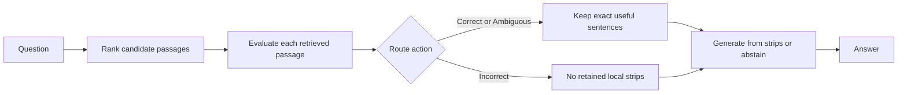

# CRAG from zero to mastery

This guide teaches the concepts behind the notebooks before asking you to interpret their output. It assumes no RAG background. By the end, you should be able to run the course safely, explain why an answer failed, and distinguish a retrieval problem from an evaluator, refinement, or generation problem.

The course is based on Shi-Qi Yan, Jia-Chen Gu, Yun Zhu, and Zhen-Hua Ling, [*Corrective Retrieval Augmented Generation* (arXiv:2401.15884)](https://arxiv.org/abs/2401.15884). The repository is a focused teaching implementation, not a paper reproduction.

## 1. The problem: an LLM does not automatically have the right evidence

An LLM generates text from patterns learned during training and from the text supplied in the current request. It can answer many questions fluently, but fluency is not evidence. A question about a private document, a recent event, or a multi-step fact may require information the model does not have in its current context.

**Retrieval-augmented generation (RAG)** adds a retrieval step before generation:

1. Turn the question into a query.
2. Search a collection of passages.
3. Give selected passages to the model as evidence.
4. Ask the model to answer from that evidence.

The hoped-for outcome is a grounded answer: an answer supported by retrieved text instead of a plausible guess. RAG is useful, but it is not a guarantee. A retriever can miss evidence, select a distractor with similar words, return only one half of a multi-hop answer, or return too much irrelevant text.

### Vocabulary you will use

| Term | Meaning in this tutorial | Why it matters |
|---|---|---|
| Question | The user’s information request. | It determines what evidence is needed. |
| Passage / document | A titled HotpotQA context paragraph. | It is the unit retrieved and evaluated. |
| Candidate pool | The paragraphs belonging to one HotpotQA question. | Main retrieval is restricted to this pool. |
| Distractor | A plausible but non-supporting paragraph. | It can look relevant without answering the question. |
| Gold title | The title of an annotated supporting paragraph. | It is a retrieval diagnostic, not a proof of a correct answer. |
| Evidence strip | An exact sentence selected from a retrieved passage. | It is the only text the CRAG generator receives. |
| Grounding | Restricting an answer to supplied evidence. | It reduces unsupported answers but cannot repair missing evidence. |
| Abstention | The fixed response that evidence is insufficient. | It is often preferable to an unsupported answer. |

### Checkpoint

Before continuing, you should be able to answer: **Why can a RAG answer be wrong even if the language model follows its instruction?**

Because the evidence may be missing, incomplete, irrelevant, misleading, or incorrectly selected before generation starts.

## 2. Retrieval: finding text is not the same as answering a question

The course uses HotpotQA `distractor` validation data. Each question has a local pool of context paragraphs, including annotated supporting paragraphs and distractors. Many questions are **multi-hop**: one paragraph supplies an intermediate fact and another completes the answer. A single highly similar paragraph may therefore be insufficient.

### How this repository retrieves

The tutorial does not call a paid embedding service. It builds local vectors with TF-IDF followed by TruncatedSVD, normalizes them, and stores them in embedded Qdrant.

- **TF-IDF** emphasizes terms that distinguish a passage from the rest of the corpus.
- **TruncatedSVD** reduces the sparse TF-IDF representation into a dense 256-dimensional vector.
- **Cosine-style vector similarity** ranks passages whose vectors are close to the question vector.

This is a transparent CPU baseline, not a semantic embedding model. It can be useful for showing retrieval mechanics, but it is vulnerable to wording changes and lexical distractors.

The main search filters Qdrant on `question_id`, so it ranks only the current question’s candidate pool. A separate notebook demonstration removes that filter and searches the entire 200-question slice. Do not confuse the latter demonstration with the benchmark protocol.

### What to inspect in the notebook

In [01_crag_tutorial.ipynb](../notebooks/01_crag_tutorial.ipynb), the retriever section prints ranked titles, scores, and whether each passage has an annotated gold title. Read them as diagnostic signals:

- A gold title in the top `k` means a supporting paragraph was retrieved, not that all required evidence was found.
- Missing a gold title is a likely retrieval gap, especially for multi-hop questions.
- A high score for a distractor shows lexical similarity, not necessarily usefulness.

### Checkpoint

Predict what happens when one of two needed supporting paragraphs is absent from top-three retrieval. A grounded system should either abstain or answer only the part established by evidence. It should not invent the missing hop.

## 3. Why naive RAG fails

**Naive RAG** in this repository means: retrieve the top-three passages and send their complete text directly to the answer generator. It has no relevance correction and no sentence selection.

That simple baseline can work when the passages directly answer the question. It can also fail in several distinct ways:

| Failure | What the model receives | Typical consequence |
|---|---|---|
| Retrieval gap | A required passage is absent. | An abstention, a partial answer, or an unsupported guess. |
| Distractor use | A passage shares terms but does not support the answer. | A fluent answer based on the wrong fact. |
| Evidence overload | Useful and irrelevant sentences are mixed together. | The generator attends to the wrong detail or cannot establish a complete answer. |
| Multi-hop loss | Only one bridge in a two-step chain is present. | The final relationship cannot be grounded. |

Naive RAG is an important baseline, not a straw person. The course later compares it against CRAG under the same retrieval and generation conditions so that the effect of correction can be inspected honestly.

## 4. CRAG: correct before generating

The CRAG paper assesses retrieved documents before choosing the next step. It uses a trained evaluator. This tutorial uses `agnes-3.0-flash` prompts as a small, inspectable substitute.

The tutorial’s flow is:



### 4.1 Evaluator

For each retrieved passage, the evaluator returns JSON with:

```text
score: 0 to 1
label: relevant or irrelevant
why: brief reason
```

The prompt explicitly treats intermediate facts in multi-hop questions as relevant. It also rejects simple keyword overlap as sufficient evidence. Output is validated before caching; malformed JSON, non-finite scores, out-of-range scores, or missing fields fail instead of becoming a stored judgement.

**Important:** an LLM relevance score is still a fallible prediction. It can score a distractor too highly or undervalue a needed bridge. The evaluator is a component to inspect, not an oracle.

### 4.2 Correct, Incorrect, and Ambiguous

The route uses the maximum evaluated score:

| Action | Tutorial rule | Meaning |
|---|---|---|
| `Correct` | maximum score is at least `0.7` | At least one retrieved passage appears strongly useful. |
| `Incorrect` | maximum score is at most `0.3` | No retrieved passage appears useful enough. |
| `Ambiguous` | otherwise | Evidence is uncertain. |

These `.7` and `.3` values are tutorial heuristics, not calibrated paper defaults. A `Correct` action does **not** prove that both multi-hop facts were retrieved, that every selected passage is useful, or that the answer will be correct.

When web recovery is disabled—as it is for the reported evaluations—`Incorrect` proceeds with no local strips and the generator abstains. The optional web branch is isolated and disabled by default; it is not part of the reported results.

### 4.3 Strip refinement

For non-`Incorrect` actions, each selected document is split into sentences. The model chooses sentence IDs, and the code keeps only exact source sentences matching those IDs. The model cannot rewrite or invent a strip.

This protects provenance: you can read every kept strip in the output and trace it back to the retrieved text. It can also lose evidence. A simple sentence boundary may split a fact badly, or the refiner may omit the bridge that connects two otherwise correct passages.

### 4.4 Grounded generation and abstention

The generator sees the question and kept strips only. It is instructed to answer concisely using supplied evidence or return exactly:

```text
I don't have enough information in the provided evidence to answer this question.
```

This is a safety-oriented behavior, not proof of truth. The model can abstain despite decisive strips, and a non-abstaining answer can still be incomplete or unsupported. Inspect both the strips and the final answer.

## 5. Run the course in order

### Notebook 00: pre-flight check

Open [00_quick_check.ipynb](../notebooks/00_quick_check.ipynb) first if you are new to the repository or troubleshooting.

It checks only whether `AGNESAI_API_KEY` and `HF_TOKEN` are present, never their values. It then performs a real `agnes-3.0-flash` ping, loads one HotpotQA row, and reports the embedded Qdrant collection count.

**Success looks like:** both variables are reported as present, the ping returns the expected response, a real row is displayed, and Qdrant opens.

**Failure means:** correct the named environment variable, Hugging Face/network access, or a competing Qdrant kernel before spending time on the larger course.

### Notebook 01: build and inspect CRAG

[01_crag_tutorial.ipynb](../notebooks/01_crag_tutorial.ipynb) is the main course. Each code cell has a teaching Markdown cell immediately before it explaining motivation, paper mapping, the next action, failure signals, and output interpretation.

Follow its sequence:

1. Learn why naive RAG fails and how the paper maps to this teaching implementation.
2. Verify the environment and load the deterministic 200-row HotpotQA slice.
3. Index passages into embedded Qdrant and compare filtered versus slice-wide retrieval.
4. Inspect evaluator scores, route boundaries, selected strips, and generated answer for three diagnostic scenarios.
5. Run the full pipeline on the eight-ID smoke set.
6. Run the resumable first-50 evaluation and inspect the candidate failure gallery.

The 50-question run is a descriptive experiment. It caches per ID so a crash can resume, but a cold run can make provider-metered requests.

### Notebook 02: compare naive RAG and CRAG fairly

[02_naive_vs_crag_comparison.ipynb](../notebooks/02_naive_vs_crag_comparison.ipynb) fixes the experimental controls:

| Held constant | Value |
|---|---|
| Questions | First 50 rows of the same deterministic slice |
| Retrieval | Same question-pool TF-IDF/SVD Qdrant search |
| Evidence count | Same top-three hits |
| Model | `agnes-3.0-flash` |
| Web recovery | Disabled |

The only intended difference is evidence treatment. Naive RAG gives complete retrieved passages directly to the generator. CRAG evaluates, routes, and reduces passages to selected strips before generation.

The final cell prints every question, reference answer, naive answer, CRAG answer, manual verdict, and rationale. Do not rely only on aggregate metrics: read answer pairs, their evidence, and the review rationale.

## 6. Interpret results responsibly

The course reports several useful signals, none of which is a complete accuracy measure.

| Signal | What it tells you | What it cannot tell you |
|---|---|---|
| Gold-title recall@k | How many annotated supporting titles appeared among retrieved hits. | Whether enough facts were present or the answer is right. |
| Literal answer substring match | Whether the reference answer appears verbatim in the generated answer. | Semantic correctness, aliases, contradictions, or support. |
| Action distribution | How the evaluator routed this slice. | That routing decisions are calibrated or correct. |
| LLM request attempts | New attempts made in this invocation. | The historical cost of a warm cache. |
| Manual review | Human judgement of these exact outputs. | A blinded or statistically generalizable evaluation. |

Read [evaluation and limitations](evaluation-and-limitations.md) before reporting any number from the notebooks.

## 7. Common errors and recovery

| Symptom | Likely cause | Recovery |
|---|---|---|
| Missing Agnes key | `AGNES_API_KEY` was used instead of `AGNESAI_API_KEY`, or the process was not restarted. | Set `AGNESAI_API_KEY` as a user environment variable and restart Jupyter/terminal. |
| HotpotQA load error | Missing `HF_TOKEN`, network issue, or wrong dataset details. | Verify `HF_TOKEN`, then use `hotpotqa/hotpot_qa`, `distractor`, `validation`. |
| HTTP 429 or transient request failure | Provider rate limiting or network failure. | Let bounded retry/backoff finish; rerun later if retries are exhausted. Completed IDs remain checkpointed. |
| JSON/schema error | The model returned fenced or invalid structured output. | The parser accepts a JSON object inside fences; invalid schemas deliberately fail and are not cached. Rerun the failed item. |
| Qdrant lock | Another kernel owns `data/qdrant`. | Shut down that kernel cleanly, then rerun. Do not delete a live database. |

## 8. Mastery path

You have mastered this tutorial when you can do all of the following from notebook evidence, not memory alone:

1. Explain why a high retrieval score is not the same as answer support.
2. Predict the route for a set of evaluator scores and explain the `.7` / `.3` boundary.
3. Identify whether a failure is a retrieval gap, distractor use, evaluator error, refinement loss, generation error, or a metric mismatch.
4. Trace a CRAG answer back from final text to strips, retrieved passages, and the question-pool search.
5. Explain why the naive-vs-CRAG comparison is fair for this slice and why it does not establish a general winner.
6. Inspect a manual-review row and state what the reference answer, method evidence, and rationale do—and do not—support.

### Suggested exercises

- Before revealing scores in notebook 01, predict which retrieved paragraphs support each hop of a multi-hop question.
- For an `Incorrect` action, decide whether the problem is truly absence of evidence or a false-negative evaluator judgement.
- Find one final-comparison row where naive RAG is better and one where CRAG is better. Explain the evidence treatment that produced the difference.
- Find a substring-metric disagreement and describe why literal matching misrepresents the human judgement.
- Change no code: write down how you would test a different threshold only after explaining why it changes routing and cache provenance.

## Where to go next

Use the [technical reference](technical-reference.md) when you need exact function contracts, cache locations, or recovery behavior. Use the [evaluation guide](evaluation-and-limitations.md) when interpreting results. The next responsible step after this course is to design a larger, pre-specified evaluation; do not claim paper replication from this tutorial slice.
